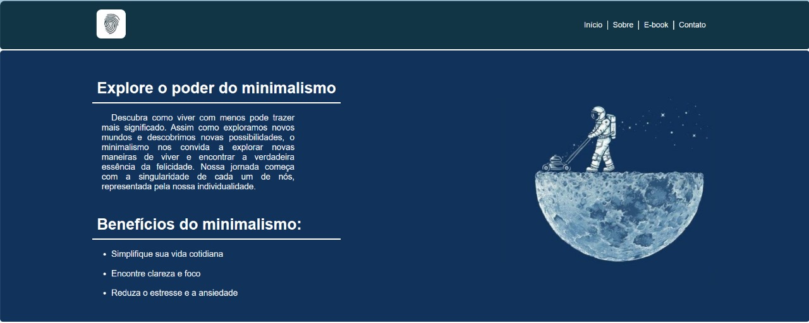

# MinimaliLife Landing Page

Bem-vindo à página inicial do MinimaliLife, onde você pode explorar o poder do minimalismo e descobrir como viver com menos pode trazer mais significado para a sua vida.

- [Minimalife](https://wesleybanagouro.github.io/Minimalife/)

## Visão Geral

- **Sobre:** Este projeto apresenta a página inicial do MinimaliLife, um site dedicado ao minimalismo.
- **Benefícios do Minimalismo:** Saiba por que simplificar sua vida pode ser transformador.
- **Explore:** Descubra recursos sobre minimalismo, clareza e foco.
- **eBook:** Baixe o eBook gratuito sobre minimalismo [aqui](link-para-o-ebook).
- **Entre em Contato:** Fale conosco para saber mais.

## Capturas de Tela

### Página Inicial

### Benefícios do Minimalismo

## Como Contribuir

Se você deseja contribuir para este projeto, siga estas etapas:

1. Faça um fork do repositório.
2. Clone o repositório em sua máquina local.
3. Faça suas melhorias e modificações.
4. Envie um pull request para revisão.

Ficarei feliz em receber contribuições!

## Autor

- [Wesley Banagouro](https://github.com/WesleyBanagouro)

## Licença

Este projeto está sob a licença MIT - veja o arquivo [LICENSE](LICENSE) para obter detalhes.

---

**Nota: Este projeto é parte de um estudo pessoal sobre desenvolvimento web e não tem fins comerciais. Apreciamos sua visita à página inicial do MinimaliLife e esperamos que encontre as informações valiosas. Não se esqueça de baixar nosso eBook gratuito sobre minimalismo.**

